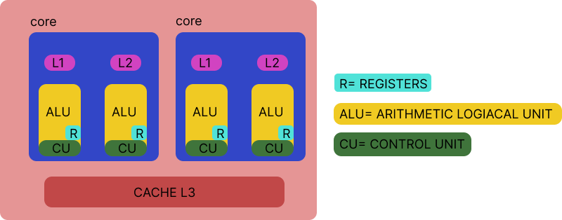
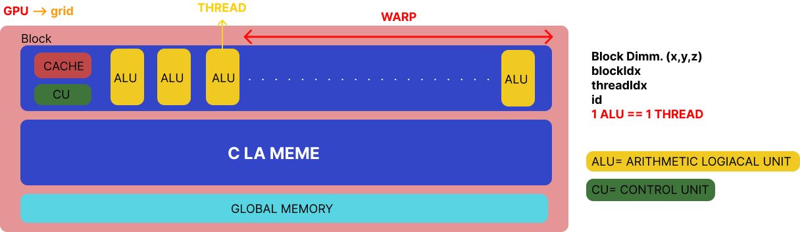

# Programmation GPU : La Puissance du Parallélisme au Service de l'Informatique

## Introduction

La programmation d’un GPU (Graphics Processing Unit) consiste à exploiter une carte graphique non plus seulement pour afficher des images, mais pour accélérer des calculs en masse grâce au parallélisme. Elle s’est imposée dans le calcul haute performance (High Performance Computing), l’intelligence artificielle (IA) et la simulation parce qu’elle permet de traiter rapidement des volumes de données et des opérations répétitives que les processeurs centraux (Central Processing Unit) classiques gèrent moins efficacement. L’idée directrice est simple : quand une tâche peut être découpée en milliers de petits calculs indépendants, un processeur graphique peut les exécuter simultanément et faire gagner un ordre de grandeur en temps et en efficacité.

### 1.1 Le pourquoi du GPU

À l'origine dédiée au rendu 3D, la carte graphique est devenue un véritable accélérateur de calcul, capable d'exécuter en parallèle des milliers de threads semblables sur de grandes quantités de données.

**Constat:** Les processeurs (CPU) sont excellents pour les tâches séquentielles et la réactivité, mais de plus en plus d'applications sont massivement parallèles: entraînement de modèles d'IA, traitement d'images et de signaux, simulations numériques, finance, bio-informatique. Miser sur le GPU, c'est profiter d'un meilleur débit de calcul, souvent avec un rapport performance/énergie plus favorable, dès que l'algorithme s'y prête.


### 1.2 Analogie clé

**Le CPU (Central Processing Unit): le PDG**   
Le CPU coordonne, prend des décisions rapides et gère des tâches variées avec souplesse. Il excelle quand la logique est complexe, que les étapes dépendent fortement les unes des autres ou que la latence de réponse est critique.

**Le GPU (Graphics Processing Unit): l'armée**  
 Le GPU mobilise des milliers de "soldats" pour exécuter les mêmed consigned sur des données différentes, en parallèle. Il brille dès qu'il faut traiter des tableaux, des images, des matrices, ou des flux massifs, où le débit global prime sur la micro-optimisation d'un seul fil d'exécution.

---

## I. Le Concept Fondamental : Parallélisme Massif

Pour comprendre CUDA, il faut cesser de penser comme un humain qui fait une tâche après l'autre (séquentiel) et commencer à penser comme une fourmilière (parallèle).

### 1.1 La Différence Structurelle

La différence entre un CPU et un GPU n'est pas une question de "puissance" brute, mais de **philosophie de travail**. Observons leur architecture respective :

#### Le CPU (Latency Oriented)


*Schéma 1 : Architecture d'un CPU moderne*

Regardez le premier schéma : un CPU typique possède **2 cœurs** (cores), chacun équipé de :
- **L1 et L2** : des mémoires cache ultra-rapides
- **ALU** (Arithmetic Logic Unit) : l'unité de calcul
- **R** (Registers) : des registres pour stocker temporairement les données
- **CU** (Control Unit) : l'unité de contrôle qui orchestre tout
- **CACHE L3** : une mémoire cache partagée entre les cœurs

Imaginez un professeur de mathématiques brillant. Il résout des équations complexes, gère des interruptions (téléphone qui sonne), et passe d'une tâche à l'autre rapidement grâce à ses caches L1/L2 qui lui donnent un accès instantané aux données récentes. Mais il est seul (ou accompagné de quelques collègues seulement). S'il doit corriger 10 000 copies simples, il devra les faire une par une pendant des heures.

**Structure :** Peu de cœurs (4 à 32), mais très rapides et polyvalents. Chaque cœur peut exécuter des instructions complexes, gérer des branchements conditionnels, et accéder efficacement à une grande mémoire cache.

#### Le GPU (Throughput Oriented)

*Schéma 2 : Architecture d'un GPU avec sa hiérarchie Grid → Block → Thread*

Regardez maintenant le second schéma : l'architecture GPU est radicalement différente. On observe :

- **Un Block** contenant des dizaines d'**ALU** (chaque ALU = 1 thread)
- **CACHE** : une mémoire partagée au niveau du bloc
- **CU** : une seule unité de contrôle pour tout le bloc
- **GLOBAL MEMORY** : la mémoire principale du GPU


Imaginez une armée de 10 000 élèves de primaire. Individuellement, ils sont lents et ne savent faire que des calculs simples (additions, multiplications). Regardez sur le schéma : tous les ALU d'un même bloc partagent la même **Control Unit** (CU). Cela signifie qu'ils exécutent **tous la même instruction au même moment**, mais sur des données différentes. Ils sont incapables de gérer des tâches complexes ou imprévues.

Mais ils sont nombreux. Si vous devez corriger 10 000 copies d'additions, chaque élève (thread) en prend une, et le travail est fini en quelques secondes.

**Structure :** Des milliers de cœurs simplifiés (2 000 à 10 000+), organisés en **Blocks** (comme visible sur le schéma). Chaque bloc possède :
- Son propre **CACHE** et sa mémoire partagée
- Des dizaines de threads (ALU) qui exécutent la même instruction simultanément
- Une **Control Unit** qui coordonne tous les threads du bloc

C'est le modèle **SIMD** (Single Instruction, Multiple Data) : une seule instruction, appliquée à des milliers de données en parallèle.

Le schéma GPU montre également la hiérarchie complète :
- **Grid** : l'ensemble de tous les blocs lancés
- **Block** : un groupe de threads partageant cache et mémoire
- **Thread** (représenté par chaque ALU) : l'unité d'exécution individuelle
- **Warp** : groupe de 32 threads qui s'exécutent de manière strictement synchrone

Cette organisation explique pourquoi le GPU excelle sur les problèmes où des milliers de calculs identiques doivent être effectués simultanément.


### 1.2 Quand utiliser le GPU ?

Le GPU n'est pas magique et ne convient pas à tous les problèmes. Il faut l'utiliser uniquement quand les données sont **indépendantes** les unes des autres.

#### Le problème séquentiel (Mauvais pour le GPU)

**Exemple :** La suite de Fibonacci `U_n = U_{n-1} + U_{n-2}`.

**Pourquoi :** Pour calculer `U_10`, il faut absolument avoir terminé `U_9` et `U_8`. Les 10 000 threads doivent attendre le résultat précédent. Le GPU sera ici plus lent que le CPU car la majorité des threads resteront inactifs.

#### Le problème "Data Parallel" (Idéal pour le GPU)

**Exemple :** L'addition de deux vecteurs ou le traitement d'image.

**Pourquoi :** Pour additionner l'élément 0 du vecteur A avec l'élément 0 du vecteur B, je n'ai pas besoin de connaître le résultat de l'addition des éléments 1, 2, 3, etc. Tous les threads peuvent travailler simultanément sans communication.

#### Exemples concrets

- **Rendu d'image / Jeux Vidéo :** Calculer la couleur de 2 millions de pixels (résolution 1080p). Chaque pixel est calculé indépendamment des autres.
- **Entraînement d'IA :** Les réseaux de neurones effectuent des multiplications matricielles massives. Chaque élément de la matrice résultante peut être calculé en parallèle.
- **Casseur de mot de passe (Force Brute) :** Tester le code "0000" n'empêche pas un autre thread de tester "9999" simultanément.
- **Simulations scientifiques :** Calcul de forces entre particules, où chaque particule peut être traitée en parallèle.

### 1.3 Comment ça "Programme" ?

Programmer un GPU demande de gérer deux processeurs séparés qui communiquent. Dans le vocabulaire CUDA, deux termes clés sont utilisés:

- **Host (L'Hôte) :** C'est le CPU et sa mémoire RAM.
- **Device (Le Périphérique) :** C'est le GPU et sa mémoire globale (VRAM).

Le flux de travail est toujours le même, en **4 étapes obligatoires** :

#### Étape 1 - Allocation & Préparation (Host)

Le CPU prépare les données dans la RAM. Il doit ensuite "réserver" de la place sur la mémoire du GPU avec la commande `cudaMalloc()`, similaire à `malloc()` mais pour le GPU.

```c
float *d_A; // Pointeur vers la mémoire GPU
cudaMalloc((void**)&d_A, size * sizeof(float));
```

#### Étape 2 - Le Transfert (Le Goulot d'étranglement)

Le GPU ne peut pas lire directement la RAM de votre PC. Il faut copier les données du Host vers le Device via le bus PCIe. C'est le rôle de `cudaMemcpy()`.

```c
cudaMemcpy(d_A, h_A, size * sizeof(float), cudaMemcpyHostToDevice);
```

#### Étape 3 - L'Exécution (Le Kernel)

Le CPU lance l'exécution sur le GPU avec une syntaxe spéciale : `fonction<<<blocs, threads>>>()`. La fonction exécutée sur le GPU s'appelle un **Kernel** et est déclarée avec `__global__`.

```c
addVectors<<<numBlocks, threadsPerBlock>>>(d_A, d_B, d_C, size);
```

#### Étape 4 - Le Rapatriement

Une fois terminé, les résultats sont bloqués dans la mémoire GPU. Il faut refaire un `cudaMemcpy()` (Device vers Host) pour les récupérer et les utiliser.

```c
cudaMemcpy(h_C, d_C, size * sizeof(float), cudaMemcpyDeviceToHost);
```

**En résumé :** On charge le camion (données), on l'envoie à l'usine (GPU), l'usine fabrique tout en parallèle, et on ramène le camion au magasin.

---

## II. Architecture CUDA : Grille, Blocs et Threads

### 2.1 La Hiérarchie à Trois Niveaux

CUDA organise les threads selon une hiérarchie à trois niveaux :

```
Grid (Grille)
└─ Blocks (Blocs)
   └─ Threads (Fils d'exécution)
```

- **Thread :** L'unité d'exécution la plus petite. C'est lui qui exécute réellement le code du kernel. Chaque thread possède son propre identifiant unique et ses propres registres.

- **Block :** Un groupe de threads (typiquement 128, 256 ou 512 threads). Les threads d'un même bloc peuvent communiquer via la **shared memory** et se synchroniser avec `__syncthreads()`.

- **Grid :** L'ensemble de tous les blocs lancés. Le grid peut être unidimensionnel, bidimensionnel ou tridimensionnel.

### 2.2 Identifiants Uniques

Chaque thread doit identifier quelle donnée il doit traiter. Pour cela, CUDA fournit des variables intégrées :

```c
threadIdx.x  // Index du thread dans son bloc (0 à blockDim.x-1)
blockIdx.x   // Index du bloc dans la grille (0 à gridDim.x-1)
blockDim.x   // Nombre de threads par bloc
gridDim.x    // Nombre de blocs dans la grille
```

#### Calcul de l'identifiant global

```c
int id = blockIdx.x * blockDim.x + threadIdx.x;
```

**Exemple concret :** Si vous avez 4 blocs de 256 threads chacun :
- Bloc 0, Thread 0 → id = 0
- Bloc 0, Thread 255 → id = 255
- Bloc 1, Thread 0 → id = 256
- Bloc 3, Thread 255 → id = 1023

---

## III. Applications Modernes

### 3.1 Intelligence Artificielle et Deep Learning

Les GPU sont devenus indispensables pour l'entraînement des réseaux de neurones. Un modèle comme GPT-3 contient 175 milliards de paramètres. L'entraînement nécessite des milliards de multiplications matricielles, opération parfaitement parallélisable. Sans GPU, l'entraînement de ces modèles prendrait des années au lieu de semaines.


### 3.2 Cryptomonnaies et Blockchain

Le minage de Bitcoin repose sur le calcul intensif de fonctions de hachage SHA-256. Chaque essai est indépendant des autres, ce qui rend le problème parfaitement parallélisable. Les mineurs utilisent aujourd'hui des GPU et des ASIC pour tester des milliards de combinaisons par seconde.

### 3.3 Science et Ingénierie

- **Simulations climatiques :** Calcul de l'évolution de millions de cellules atmosphériques en parallèle.
- **Astrophysique :** Simulation de la formation des galaxies avec des milliards de particules.
- **Rendu 3D et Animation :** Pixar et autres studios utilisent énormément de GPU en simultané pour le rendu de films d'animation.

### 3.4 Traitement d'Image et Vidéo

- **Filtres en temps réel :** Instagram, Snapchat appliquent des filtres sur des vidéos 1080p à 30 fps.
- **Vision par ordinateur :** Reconnaissance faciale, détection d'objets pour les voitures autonomes.
- **Compression vidéo :** Encodage H.264/H.265 accéléré par GPU.

---

# IV. Exemple Pratique : Casseur de Code PIN

Ce tutoriel vous guide pas à pas pour reproduire le casseur de code PIN avec deux approches : CPU et GPU. À la fin, vous lancerez le code et observerez la différence de performance.

## Sommaire
1. [Prérequis](#prérequis)
2. [Introduction](#introduction)
3. [Partie 1 : Kernel GPU](#partie-1--kernel-gpu)
4. [Partie 2 : Comparaison CPU et Configuration GPU](#partie-2--comparaison-cpu-et-configuration-gpu)
5. [Partie 3 : Gestion Mémoire et Lancement GPU](#partie-3--gestion-mémoire-et-lancement-gpu)
6. [Exécution](#exécution)
7. [Analyse des Résultats](#analyse-des-résultats)

---

## Prérequis

- Google Colab avec GPU activé (Runtime → Change runtime type → GPU)

---

## Introduction

Ce tutoriel présente la **programmation parallèle sur GPU avec CUDA** à travers un exemple concret : trouver un code PIN parmi **1 milliard de combinaisons** (0 à 999 999 999).

L'objectif est de comprendre comment le GPU peut résoudre des problèmes massivement parallèles en lançant des milliers de threads simultanément, contrairement au CPU qui traite les données séquentiellement. Nous comparerons les deux approches pour mesurer l'accélération apportée par le GPU.

Le principe : au lieu de tester les codes un par un, nous lançons **1 milliard de threads en parallèle**, chacun testant une combinaison différente simultanément.

---

## Partie 1 : Kernel GPU

```cuda
#include <stdio.h>
#include <cuda_runtime.h>
#include <time.h>

__global__ void findPinKernel(int* d_resultat, int code_secret) {
    int mon_id = blockIdx.x * blockDim.x + threadIdx.x;
    
    if (mon_id < 1000000000) {
        if (mon_id == code_secret) {
            *d_resultat = mon_id;
        }
    }
}
```

**Explication :**

Le **kernel** est une fonction qui s'exécute sur le GPU, marquée par le mot-clé `__global__`.

**Formule d'ID thread :** `mon_id = blockIdx.x * blockDim.x + threadIdx.x`
- `blockIdx.x` : numéro du bloc dans la grille
- `blockDim.x` : nombre de threads par bloc (1024)
- `threadIdx.x` : numéro du thread dans son bloc
- Résultat : chaque thread obtient un identifiant unique de 0 à ~1 milliard

**Logique :** Chaque thread teste UNE SEULE combinaison (son ID). Si le thread trouve le code secret, il l'écrit dans la mémoire GPU pointée par `d_resultat`. Tous les threads s'exécutent en parallèle.

---

## Partie 2 : Comparaison CPU et Configuration GPU

```cuda
int main() {
    const int SECRET_PIN = 999999999;
    const int NOMBRE_COMBINAISONS = 1000000000;

    printf("Objectif : Trouver le code PIN secret (%d) parmi %d combinaisons.\n", 
           SECRET_PIN, NOMBRE_COMBINAISONS);
    
    int resultat_cpu = -1;
    int resultat_gpu_host = -1;
    clock_t start, end;
    double temps_cpu, temps_gpu;

    // ========== VERSION CPU (pour comparaison) ==========
    printf("\nLancement de l'attaque CPU (séquentielle)...\n");
    start = clock();
    for (int i = 0; i < NOMBRE_COMBINAISONS; i++) {
        if (i == SECRET_PIN) {
            resultat_cpu = i;
            break;
        }
    }
    end = clock();
    temps_cpu = ((double) (end - start)) / CLOCKS_PER_SEC;
    printf("CPU - Code trouvé : %d\n", resultat_cpu);
    printf("CPU - Temps : %f secondes (%d étapes)\n", temps_cpu, resultat_cpu + 1);

    // ========== CONFIGURATION GPU ==========
    printf("\nLancement de l'attaque GPU (parallèle)...\n");
    start = clock();
    
    int threadsPerBlock = 1024;
    int numBlocks = (NOMBRE_COMBINAISONS + threadsPerBlock - 1) / threadsPerBlock;
    
    printf("Configuration GPU: %d blocs × %d threads = %d threads totaux\n", 
           numBlocks, threadsPerBlock, numBlocks * threadsPerBlock);
```

**Explication :**

**Partie CPU :** On calcule d'abord avec le CPU en testant séquentiellement chaque combinaison dans une boucle `for`. Cette partie sert de **référence** pour mesurer l'accélération du GPU. Le CPU doit parcourir jusqu'à 1 milliard d'itérations.

**Configuration GPU :** 
- `threadsPerBlock = 1024` : nombre maximum de threads par bloc (limite matérielle des GPU)
- `numBlocks` : calculé pour couvrir toutes les combinaisons → 976 563 blocs
- **Architecture CUDA :** Les threads sont organisés en blocs, eux-mêmes organisés en grille
- Total : 976 563 blocs × 1024 threads/bloc = ~1 milliard de threads lancés en parallèle

---

## Partie 3 : Gestion Mémoire et Lancement GPU

```cuda
    // ========== ALLOCATION MÉMOIRE GPU ==========
    int* d_resultat;
    cudaError_t err = cudaMalloc((void**)&d_resultat, sizeof(int));
    if (err != cudaSuccess) {
        printf("Erreur cudaMalloc: %s\n", cudaGetErrorString(err));
        return 1;
    }

    // ========== TRANSFERT CPU → GPU ==========
    err = cudaMemcpy(d_resultat, &resultat_gpu_host, sizeof(int), cudaMemcpyHostToDevice);
    if (err != cudaSuccess) {
        printf("Erreur cudaMemcpy H2D: %s\n", cudaGetErrorString(err));
        return 1;
    }

    // ========== LANCEMENT DU KERNEL ==========
    findPinKernel<<<numBlocks, threadsPerBlock>>>(d_resultat, SECRET_PIN);
    cudaDeviceSynchronize();

    // ========== TRANSFERT GPU → CPU ==========
    err = cudaMemcpy(&resultat_gpu_host, d_resultat, sizeof(int), cudaMemcpyDeviceToHost);
    if (err != cudaSuccess) {
        printf("Erreur cudaMemcpy D2H: %s\n", cudaGetErrorString(err));
        return 1;
    }

    // ========== LIBÉRATION MÉMOIRE ==========
    cudaFree(d_resultat);

    end = clock();
    temps_gpu = ((double) (end - start)) / CLOCKS_PER_SEC;

    printf("GPU - Code trouvé : %d\n", resultat_gpu_host);
    printf("GPU - Temps : %f secondes (toutes combinaisons en parallèle)\n", temps_gpu);

    // ========== RÉSULTATS ==========
    printf("\n--- Conclusion ---\n");
    printf("Temps CPU: %f sec\n", temps_cpu);
    printf("Temps GPU: %f sec (inclut la préparation)\n", temps_gpu);
    
    if (temps_cpu > temps_gpu) {
        printf("ACCÉLÉRATION: Le GPU est %.2fx plus rapide !\n", temps_cpu / temps_gpu);
    }
    
    return 0;
}
```

**Explication :**

**Workflow CUDA en 5 étapes :**

1. **`cudaMalloc`** : Alloue de la mémoire sur le GPU (comme `malloc` mais pour le GPU). Le préfixe `d_` indique "device" (GPU).

2. **`cudaMemcpy(Host→Device)`** : Copie les données du CPU vers le GPU. La mémoire du GPU est séparée de la RAM, il faut transférer explicitement.

3. **`kernel<<<blocs, threads>>>()`** : Syntaxe spéciale CUDA pour lancer le kernel avec la configuration désirée. Les `<<<>>>` définissent combien de threads exécuteront le kernel.

4. **`cudaDeviceSynchronize()`** : Bloque le CPU jusqu'à ce que tous les threads GPU aient terminé leur exécution.

5. **`cudaMemcpy(Device→Host)`** : Récupère le résultat depuis le GPU vers le CPU, puis `cudaFree` libère la mémoire GPU.

**Point clé :** La mémoire GPU et CPU sont physiquement séparées. Toute donnée doit être explicitement transférée entre les deux.

---


## Exécution

**Dans Google Colab :**

Cellule 1 - Créer le fichier :
```python
%%writefile Casseur_de_Code_GPUvsCPU.cu
[Copier tout le code ci-dessus]
```

Cellule 2 - Compiler et exécuter :
```bash
!nvcc -o casseur Casseur_de_Code_GPUvsCPU.cu
!./casseur
```

Le programme affichera les temps d'exécution CPU vs GPU et le facteur d'accélération.


## Analyse des Résultats

### Ordre de grandeur observé
Le GPU est environ **15 à 20 fois plus rapide** que le CPU pour ce problème.

- **CPU** : plusieurs secondes (≈ 2–3 s)  
- **GPU** : une fraction de seconde (≈ 0.1–0.2 s)

### Pourquoi cette accélération ?
- Le **CPU** teste les combinaisons **une par une** → 1 milliard d’itérations séquentielles.  
- Le **GPU** lance **~1 milliard de threads**, chacun testant une combinaison **en parallèle**, dans une seule vague d’exécution.

### Cas limite important
Si l’on cherche un code plus petit (ex. `1000` au lieu de `999 999 999`), l’écart de performance se réduit fortement :

- Le **CPU** trouve le code en quelques millisecondes (arrêt précoce).
- Le **GPU** met toujours ≈ **0.12 s**, car il **exécute tous les threads**, même si la solution est trouvée très tôt.

### Conclusion
Le GPU est avantageux pour les problèmes **massivement parallèles** où **toutes les données doivent être traitées**.  
Pour les recherches pouvant s’arrêter tôt, le CPU peut parfois être plus efficace.  
Le coût de préparation du GPU (allocations, transferts) n’est amorti que sur de **gros volumes de calcul**.


